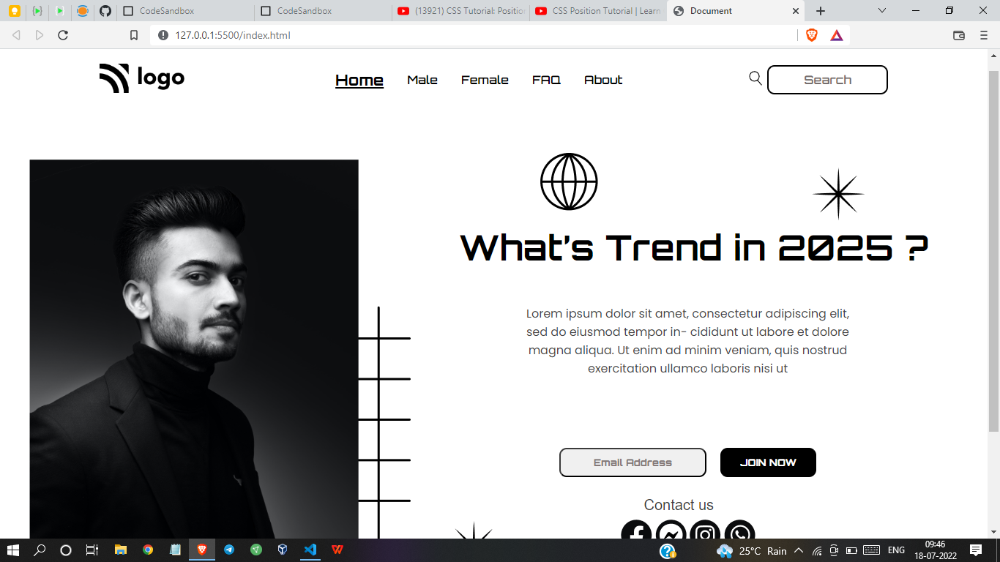

# Project 1 - HTML  and CSS 

By Shreesha

Here's the Live Deployed Website  

[DEPLOYED WEBSITE LINK](https://html-live-project-01.netlify.app/)

## What I have learned in this project?

- This was our first project.I have got to learn many new things.
- Got to learn basics of CSS
- How to apply `margin, padding.`
- How to `positions` the elements.
- Also got to learn about the `z-index`. 

## This project took 5 hours to complete.

